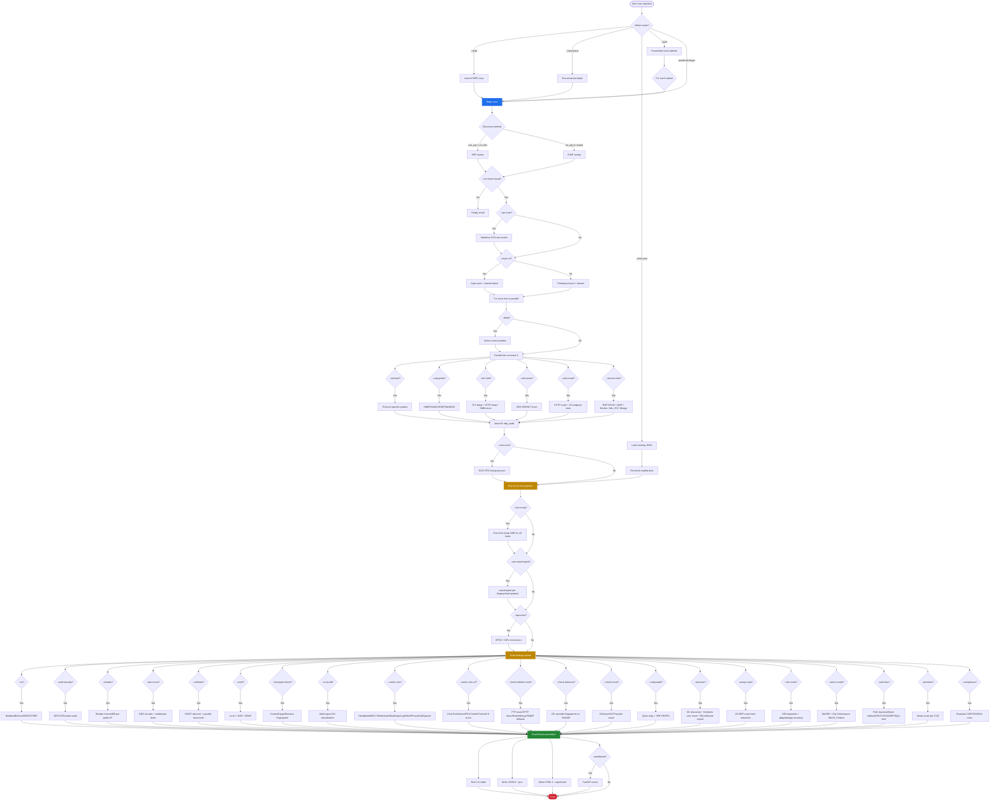
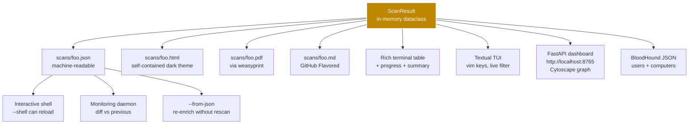

# Explotica — Architecture Documentation

This document covers the **system architecture**, **data flow**, **execution
flowchart**, and **module dependency graph** for the Explotica recon scanner.

All diagrams use Mermaid syntax and render natively on GitHub.

---

## 1. System Architecture (Layered)

The system is organized as a stack of layers, each consuming the layer below
and producing data for the layer above. Each box is a real Python module in
the `explotica/` package.

```mermaid
flowchart TB

    subgraph IF["🎮 INTERFACES"]
        CLI["cli.py<br/>argparse + rich"]
        WIZ["interactive.py<br/>wizard (--interactive)"]
        SHELL["shell.py<br/>REPL (--shell)"]
        DAEMON["daemon.py<br/>continuous monitor"]
        PLUGIN["plugins.py<br/>entry-points"]
    end

    subgraph ORCH["🎯 ORCHESTRATION"]
        SCANNER["scanner.run_scan()"]
    end

    subgraph IO["⚡ I/O FOUNDATION"]
        AIO["aio.py<br/>asyncio + uvloop"]
        SYN["syn_scan.py<br/>raw socket SYN"]
    end

    subgraph DISC["📡 DISCOVERY"]
        DISCOVERY["discovery.py<br/>ARP + ICMP"]
        ENUM["enumerate.py<br/>local subnets"]
        NETFAB["netfabric.py<br/>DHCP + traceroute"]
    end

    subgraph PROBE["🔍 PROBE LAYER"]
        PORTS["ports.py"]
        BANNERS["banners.py"]
        SVCFP["service_fp.py<br/>active deep probes"]
        UNMASK["protocol_probes.py"]
        UDP["udp_probes.py"]
        SVCV2["service_probes_v2.py<br/>RDP/LDAP/Docker/k8s"]
        FPDB["service_fp_db.py<br/>30 services"]
    end

    subgraph ENRICH["🏷️ ENRICHMENT"]
        OUI["oui.py"]
        OSFP["os_fp_db.py<br/>multi-signal OS"]
        TLS["tls_scan.py"]
        SMB["smb_scan.py"]
        SSHENUM["ssh_enum.py"]
        HTTP["http_scan.py"]
    end

    subgraph WEB["🌐 WEB DEEP"]
        CRAWL["web_crawler.py"]
        AUDIT["http_audit.py<br/>methods/CORS/GraphQL/WP"]
        FUZZ["web_fuzz.py<br/>SQLi/XSS/SSRF"]
        PLAY["playwright_crawler.py<br/>headless Chrome"]
        WEBSEC["web_security.py<br/>JWT/CSP/cookies"]
    end

    subgraph AUTH["🔑 AUTH'D SCAN"]
        SSH["creds_scan.py<br/>SSH + paramiko"]
        WINRM["winrm_scan.py<br/>Windows + pywinrm"]
    end

    subgraph SPECIAL["🏢 AD / ICS / OSINT"]
        AD["ad_enum.py<br/>DC + Kerberos"]
        KERB["kerberoast.py<br/>AS-REP roast"]
        ICS["ics.py<br/>Modbus/BACnet/DNP3"]
        SMTP["smtp_test.py"]
        OSINT["osint.py<br/>crt.sh + ASN + RDAP"]
        SHODAN["shodan_lite.py"]
        DNS["dns_enum.py"]
    end

    subgraph ACTIVE["💥 ACTIVE CHECKS"]
        DEFCREDS["default_creds.py"]
        TAKEOVER["takeover.py<br/>subdomain takeover"]
        CLOUD["cloud_assets.py<br/>S3/Azure/GCP"]
        VER1["verify_probes.py<br/>7 CVEs"]
        VER2["verify_probes_v2.py<br/>14 more CVEs"]
    end

    subgraph VULN["🐛 VULN MATCH"]
        VULNSCAN["vulnscan.py"]
        NVD["nvd.py<br/>cache + semaphore"]
        EPSS["epss_kev.py<br/>CISA KEV + EPSS"]
        NMAP["nmap_wrap.py<br/>nmap NSE"]
        SEARCH["searchsploit_wrap.py"]
    end

    subgraph ANALYSIS["📊 ANALYSIS"]
        PRIO["prioritize.py<br/>CVSS+EPSS+KEV+exposure"]
        HONEYPOT["honeypot.py"]
        COMP["compliance.py<br/>CIS/PCI/HIPAA"]
    end

    subgraph OUT["📤 OUTPUT"]
        MODELS["models.py<br/>Host/Port/CVE/Exploit"]
        REPORT["report.py<br/>HTML"]
        REPORTPDF["report_pdf.py<br/>PDF + Markdown"]
        TUI["tui.py<br/>Textual"]
        DASH["dashboard.py<br/>FastAPI + Cytoscape"]
    end

    %% Connections from interfaces down
    CLI --> SCANNER
    WIZ --> CLI
    SHELL --> CLI
    DAEMON --> CLI
    PLUGIN --> SCANNER

    %% Orchestrator pulls from every layer
    SCANNER --> AIO
    SCANNER --> SYN
    SCANNER --> DISCOVERY
    SCANNER --> ENUM
    SCANNER --> NETFAB
    SCANNER --> PORTS
    SCANNER --> BANNERS
    SCANNER --> SVCFP
    SCANNER --> UNMASK
    SCANNER --> UDP
    SCANNER --> SVCV2
    SCANNER --> FPDB
    SCANNER --> OUI
    SCANNER --> OSFP
    SCANNER --> TLS
    SCANNER --> SMB
    SCANNER --> SSHENUM
    SCANNER --> HTTP
    SCANNER --> CRAWL
    SCANNER --> AUDIT
    SCANNER --> FUZZ
    SCANNER --> WEBSEC
    SCANNER --> SSH
    SCANNER --> WINRM
    SCANNER --> AD
    SCANNER --> KERB
    SCANNER --> ICS
    SCANNER --> SMTP
    SCANNER --> OSINT
    SCANNER --> SHODAN
    SCANNER --> DNS
    SCANNER --> DEFCREDS
    SCANNER --> TAKEOVER
    SCANNER --> CLOUD
    SCANNER --> VER1
    SCANNER --> VER2
    SCANNER --> VULNSCAN
    SCANNER --> EPSS
    SCANNER --> NMAP
    SCANNER --> SEARCH
    SCANNER --> PRIO
    SCANNER --> HONEYPOT
    SCANNER --> COMP

    %% Vuln matching uses NVD
    VULNSCAN --> NVD
    EPSS --> NVD
    SSH --> NVD
    WINRM --> NVD

    %% All probes write into MODELS
    SVCFP --> MODELS
    UNMASK --> MODELS
    UDP --> MODELS
    SVCV2 --> MODELS
    TLS --> MODELS
    SMB --> MODELS
    SSHENUM --> MODELS
    HTTP --> MODELS

    %% Output consumes MODELS
    MODELS --> REPORT
    MODELS --> REPORTPDF
    MODELS --> TUI
    MODELS --> DASH

    style SCANNER fill:#1f6feb,stroke:#fff,color:#fff,stroke-width:2px
    style MODELS fill:#bf8700,stroke:#fff,color:#fff
    style CLI fill:#238636,stroke:#fff,color:#fff
    style WIZ fill:#238636,stroke:#fff,color:#fff
    style SHELL fill:#238636,stroke:#fff,color:#fff
```

---

## 2. Data Flow Diagram

How data moves through the system during a scan, from user input to final
outputs.

```mermaid
flowchart LR

    USER["👤 User<br/>target + flags"]

    USER --> PARSER["CLI Parser<br/>(or wizard/shell)"]

    PARSER --> ORCH["run_scan()<br/>orchestrator"]

    subgraph PHASE1["Phase 1: Discovery"]
        ORCH --> DISC["ARP/ICMP discovery"]
        DISC --> HOSTLIST["[Host objects]"]
    end

    subgraph PHASE2["Phase 2: Per-host pipeline (parallel)"]
        HOSTLIST --> ENRICH["_enrich: hostname + MAC vendor + TTL"]
        ENRICH --> SCAN_PORTS["port scan<br/>(async or threaded)"]
        SCAN_PORTS --> PORTOBJS["[Port objects]"]
        PORTOBJS --> BAN["parallel banner grab"]
        BAN --> DEEP["deep probes<br/>(HTTP GET, FTP SYST, SMB neg.)"]

        DEEP --> PARFAN["Parallel fan-out (8-way):"]
        PARFAN --> UNM["unmask probes"]
        PARFAN --> UDPP["UDP probes"]
        PARFAN --> RICH["rich intel<br/>(TLS/HTTP/SMB)"]
        PARFAN --> SSH_E["SSH enum"]
        PARFAN --> CR["web crawl"]
        PARFAN --> SVCI["service intel"]
        PARFAN --> HA["http_audit"]

        UNM & UDPP & RICH & SSH_E & CR & SVCI & HA --> POSTFAN

        POSTFAN["all phase-2 enrichment done"]
        POSTFAN --> VS["vuln scan<br/>(NVD lookup per CPE)"]
    end

    subgraph PHASE3["Phase 3: Post-pipeline (whole-batch)"]
        VS --> ONESHOT["one-shot nmap NSE<br/>(all hosts in one process)"]
        ONESHOT --> SE["searchsploit lookups"]
        SE --> EK["EPSS + KEV enrichment"]
        EK --> SH["Shodan InternetDB"]
        SH --> DN["DNS enum (if domain)"]
        DN --> NF["DHCP + traceroute"]
    end

    subgraph PHASE4["Phase 4: Analysis modules"]
        NF --> ICS_M["ICS probes"]
        ICS_M --> WSEC["web security audit"]
        WSEC --> DCR["default creds<br/>(opt-in)"]
        DCR --> SMTPA["SMTP audit"]
        SMTPA --> TAKE["takeover detection"]
        TAKE --> CLO["cloud asset enum"]
        CLO --> ADE["AD enum"]
        ADE --> KR["AS-REP roast"]
        KR --> WINC["WinRM creds scan"]
        WINC --> SSHC["SSH creds scan"]
        SSHC --> VC1["verify probes v1"]
        VC1 --> VC2["verify probes v2"]
        VC2 --> WF["web fuzzing"]
        WF --> HONEY["honeypot detection"]
        HONEY --> PRZ["prioritization scoring"]
        PRZ --> CMP["compliance evaluation"]
    end

    CMP --> SR["ScanResult<br/>(in memory)"]

    subgraph PHASE5["Phase 5: Outputs (all in parallel)"]
        SR --> CLITAB["rich terminal table"]
        SR --> JSON["JSON file"]
        SR --> HTML["HTML report"]
        SR --> PDF["PDF report<br/>(weasyprint)"]
        SR --> MD["Markdown report"]
        SR --> DASHBD["FastAPI dashboard<br/>+ Cytoscape graph"]
        SR --> TUIOUT["Textual TUI"]
        SR --> BH["BloodHound JSON<br/>(if AD enum)"]
    end

    style ORCH fill:#1f6feb,stroke:#fff,color:#fff,stroke-width:2px
    style SR fill:#bf8700,stroke:#fff,color:#fff,stroke-width:2px
    style USER fill:#238636,stroke:#fff,color:#fff
```

---

## 3. Execution Flowchart (decision tree)

How a single scan flows through the orchestrator, with branching for each
optional module. Light boxes = always run, blue boxes = conditional on flags.

---

## 4. Module Dependency Graph (simplified)

Which modules import which. Edges point from importer to importee. Only the
most architecturally significant dependencies shown.

```mermaid
graph LR
    CLI[cli.py] --> SCANNER[scanner.py]
    CLI --> SHELL[shell.py]
    CLI --> INTER[interactive.py]
    CLI --> DASH[dashboard.py]
    CLI --> TUI[tui.py]
    CLI --> REPORT[report.py]
    CLI --> REPORTPDF[report_pdf.py]

    SHELL --> CLI
    INTER --> CLI

    SCANNER --> MODELS[models.py]
    SCANNER --> DISCOVERY[discovery.py]
    SCANNER --> PORTS[ports.py]
    SCANNER --> BANNERS[banners.py]
    SCANNER --> SVCFP[service_fp.py]
    SCANNER --> VULNSCAN[vulnscan.py]
    SCANNER --> NMAPW[nmap_wrap.py]
    SCANNER --> SE[searchsploit_wrap.py]
    SCANNER --> EPSS[epss_kev.py]
    SCANNER --> AIO[aio.py]
    SCANNER --> SYNS[syn_scan.py]
    SCANNER --> AD[ad_enum.py]
    SCANNER --> KERB[kerberoast.py]
    SCANNER --> ICS[ics.py]
    SCANNER --> CLOUD[cloud_assets.py]
    SCANNER --> TAKEOVER[takeover.py]
    SCANNER --> OSINT[osint.py]
    SCANNER --> DNS[dns_enum.py]
    SCANNER --> NETF[netfabric.py]
    SCANNER --> WEBCRAWL[web_crawler.py]
    SCANNER --> HTTP[http_scan.py]
    SCANNER --> AUDIT[http_audit.py]
    SCANNER --> FUZZ[web_fuzz.py]
    SCANNER --> WEBSEC[web_security.py]
    SCANNER --> TLS[tls_scan.py]
    SCANNER --> SMB[smb_scan.py]
    SCANNER --> SSHENUM[ssh_enum.py]
    SCANNER --> CREDS[creds_scan.py]
    SCANNER --> WINRM[winrm_scan.py]
    SCANNER --> SVCV2[service_probes_v2.py]
    SCANNER --> SMTPT[smtp_test.py]
    SCANNER --> DCREDS[default_creds.py]
    SCANNER --> HP[honeypot.py]
    SCANNER --> PRZ[prioritize.py]
    SCANNER --> CMP[compliance.py]
    SCANNER --> VER1[verify_probes.py]
    SCANNER --> VER2[verify_probes_v2.py]
    SCANNER --> OSFP[os_fp_db.py]
    SCANNER --> FPDB[service_fp_db.py]
    SCANNER --> SHODAN[shodan_lite.py]
    SCANNER --> ENUM[enumerate.py]
    SCANNER --> OUI[oui.py]
    SCANNER --> UNMASK[protocol_probes.py]
    SCANNER --> UDP[udp_probes.py]

    %% Vulnerability-related uses NVD
    VULNSCAN --> NVD[nvd.py]
    EPSS --> NVD
    CREDS --> NVD
    WINRM --> NVD

    %% Common deps on models
    DISCOVERY --> MODELS
    PORTS --> MODELS
    BANNERS --> MODELS
    AD --> DNS

    %% Shell uses dashboards
    SHELL --> DASH
    SHELL --> TUI
    SHELL --> REPORT
    SHELL --> REPORTPDF
    SHELL --> PRZ
    SHELL --> CMP

    %% Daemon spawns CLI
    DAEMON[daemon.py] -.subprocess.-> CLI

    %% Dashboard reads JSON
    DASH --> MODELS
    TUI --> MODELS

    style SCANNER fill:#1f6feb,stroke:#fff,color:#fff,stroke-width:2px
    style MODELS fill:#bf8700,stroke:#fff,color:#fff
    style NVD fill:#bf8700,stroke:#fff,color:#fff
    style CLI fill:#238636,stroke:#fff,color:#fff
```

---

## 5. Output / Distribution

Every scan produces a `ScanResult` dataclass which can be rendered in 8
formats simultaneously.

---

## Module Inventory

| Layer | Modules |
|---|---|
| Interface | `cli.py`, `interactive.py`, `shell.py`, `daemon.py`, `plugins.py` |
| Orchestration | `scanner.py` |
| I/O Foundation | `aio.py`, `syn_scan.py` |
| Discovery | `discovery.py`, `enumerate.py`, `netfabric.py` |
| Probe | `ports.py`, `banners.py`, `service_fp.py`, `protocol_probes.py`, `udp_probes.py`, `service_probes_v2.py`, `service_fp_db.py` |
| Enrichment | `oui.py`, `os_fp_db.py`, `os_fingerprint.py`, `tls_scan.py`, `smb_scan.py`, `ssh_enum.py`, `http_scan.py` |
| Web deep | `web_crawler.py`, `http_audit.py`, `web_fuzz.py`, `playwright_crawler.py`, `web_security.py` |
| Auth'd scan | `creds_scan.py`, `winrm_scan.py` |
| AD / ICS / OSINT | `ad_enum.py`, `kerberoast.py`, `ics.py`, `smtp_test.py`, `osint.py`, `shodan_lite.py`, `dns_enum.py` |
| Active checks | `default_creds.py`, `takeover.py`, `cloud_assets.py`, `verify_probes.py`, `verify_probes_v2.py` |
| Vuln match | `vulnscan.py`, `nvd.py`, `epss_kev.py`, `nmap_wrap.py`, `searchsploit_wrap.py` |
| Analysis | `prioritize.py`, `honeypot.py`, `compliance.py` |
| Output | `models.py`, `report.py`, `report_pdf.py`, `tui.py`, `dashboard.py` |

**Total: 48 Python modules across 12 logical layers, ~15,500 LOC.**

---

## Key design patterns

| Pattern | Where it lives | Why |
|---|---|---|
| **Lazy scapy imports** | `discovery.py`, `syn_scan.py`, `netfabric.py` | scapy is heavy + may not be installed in dev |
| **Future-based dedup cache** | `nvd.py` `_inflight` dict | Same CPE across 20 hosts = 1 NVD call |
| **Two-wave parallel pipeline** | `scanner.py` enrichment phases | Independent phases fan out; http_audit waits for web_crawl |
| **Lazy heavy-dependency imports** | `dashboard.py`, `tui.py`, `playwright_crawler.py` | Only load fastapi/textual/playwright when used |
| **Plugin entry points** | `plugins.py` | Third parties extend without forking |
| **Models as contract** | `models.py` `to_dict`/`from_dict` | Every output format reads the same dataclass |
| **Wall-clock safety budget** | `syn_scan.py` | Prevents 25-min hangs |
| **Defensive scapy reinit** | `enumerate.py` | Handles `conf.route is None` edge case |
| **HTTP keep-alive for NVD** | `nvd.py` | TLS handshake reuse — 150ms saved per call |
